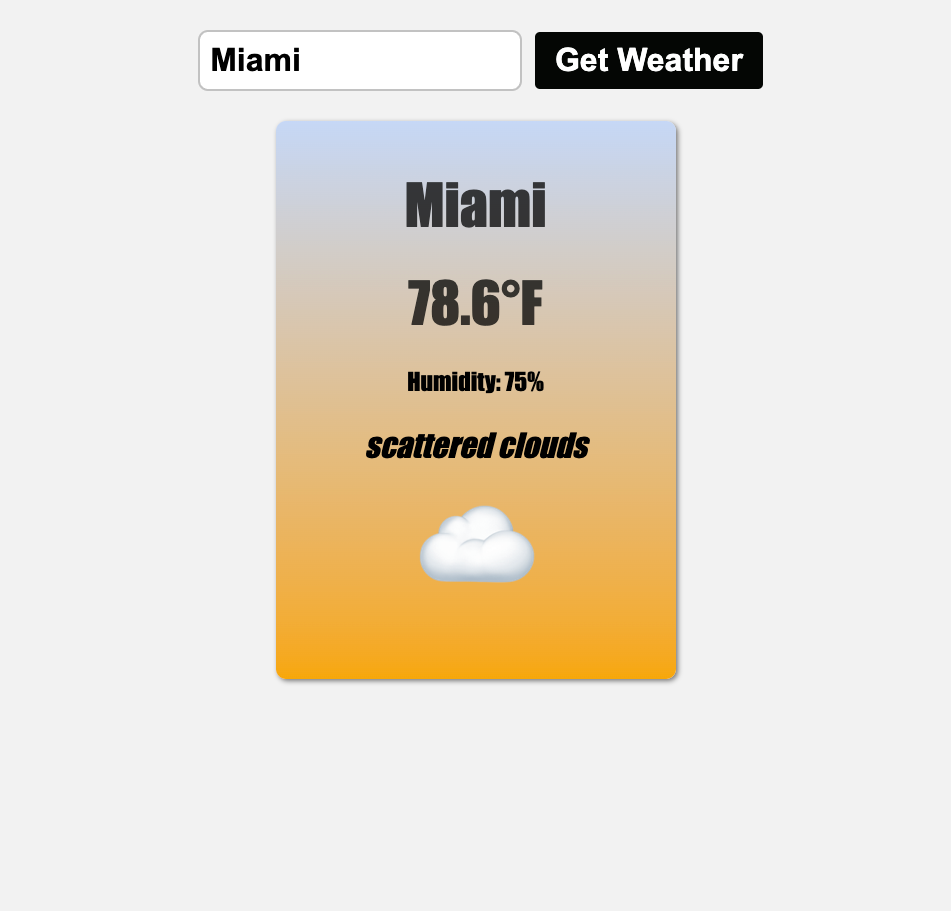

# sample-weather-app

## Description

This app utilizes a weather API so that when a user enters the name of a city; it will display the temperature, humidity, weather conditions, and an emoji to portray the weather.

## Finished Product

## Credits

- This tutorial helped me create this weather app
    - **<https://www.youtube.com/watch?v=VaDUGPMjzOM>**

## License

MIT License -- see more details in my repo

